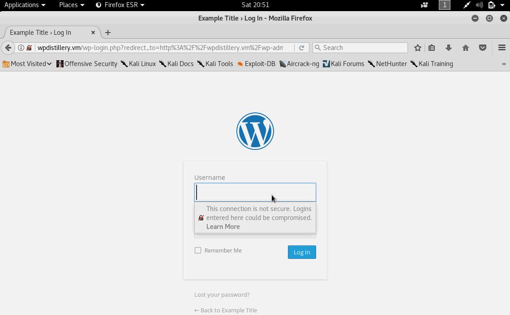
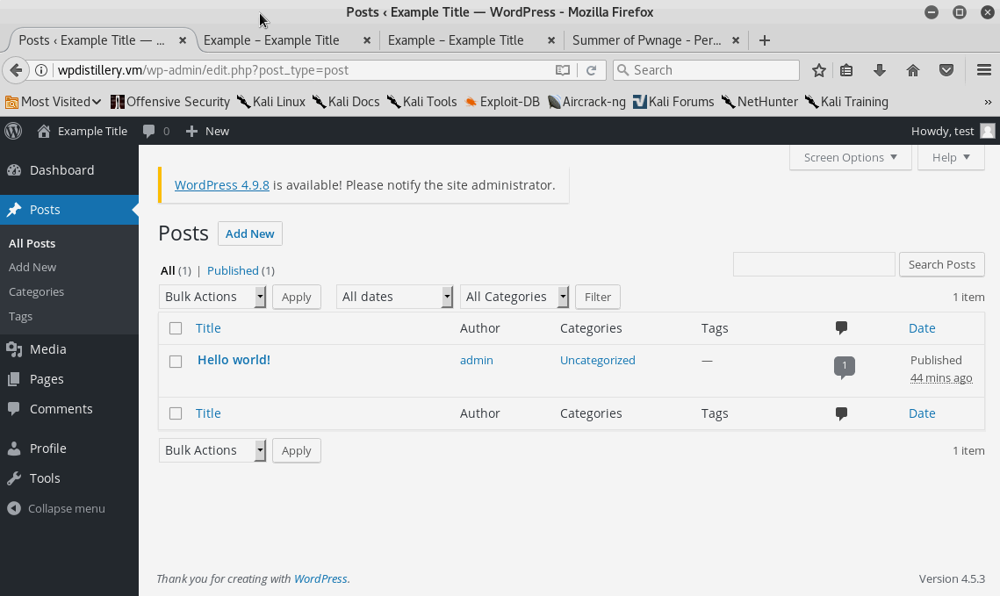
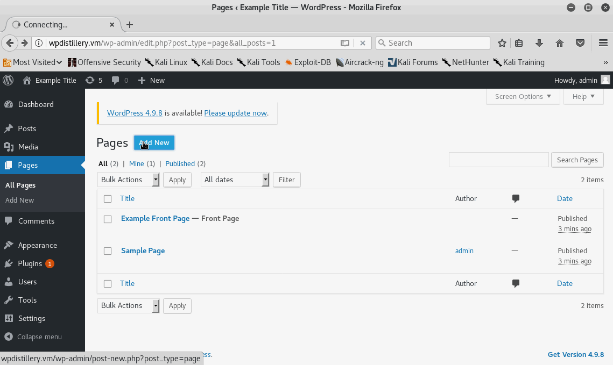

# Project 7 - WordPress Pentesting

Time spent: **6** hours spent in total

> Objective: Find, analyze, recreate, and document **five vulnerabilities** affecting an old version of WordPress

## Pentesting Report

1. (Required) User Enumeration
  - [✔] Summary: 
    	- Vulnerability types: User Enumeration
    	- Tested in version: 4.2
    	- Fixed in version: 4.5
  - [✔] GIF Walkthrough: 
  - [✔] Steps to recreate:
    	- Install WordPress version 4.2 or lower
    	- Create a couple of different users
    	- Logout
    	- Try to login using the different usernames created while intentionally typing wrong password to check if those users exist
  - [✔] Affected source code:
    - [Link 1](https://core.trac.wordpress.org/browser/tags/version/src/source_file.php)

2. (Required) XSS
  - [✔] Summary: Users that have either editor or author accounts can embed cross site scripting via posts or pages.
    	- Vulnerability types: XSS
    	- Tested in version: 4.5.3
    	- Fixed in version: 4.6.1
  - [✔] GIF Walkthrough: 
  - [✔] Steps to recreate: 
  		- Install WordPress version 4.5.3 or prior
  		- Create a user with either editor or author priviledges
  		- Login with new user and replicate embed shown above in a post
  - [✔] Affected source code:
    - [Link 1](https://core.trac.wordpress.org/browser/tags/version/src/source_file.php)

3. (Required) XSS
  - [✔] Summary: Any user that can create a new page or post can embed cross site scripting by adding image tag in which it can be used to expose cookie data and other response information.
    	- Vulnerability types: XSS
    	- Tested in version: 4.6.1
    	- Fixed in version: 4.6.2
  - [✔] GIF Walkthrough: 
  - [✔] Steps to recreate: 
  		- Install WordPress version 4.6.1 or prior
  		- Add a new post or page with the following code 
  - [✔] Affected source code:
    - [Link 1](https://core.trac.wordpress.org/browser/tags/version/src/source_file.php)

## Resources

- [WordPress Source Browser](https://core.trac.wordpress.org/browser/)
- [WordPress Developer Reference](https://developer.wordpress.org/reference/)

GIFs created with [LiceCap](http://www.cockos.com/licecap/).

## License

    Copyright [2018] [Andrew Gabriel]

    Licensed under the Apache License, Version 2.0 (the "License");
    you may not use this file except in compliance with the License.
    You may obtain a copy of the License at

        http://www.apache.org/licenses/LICENSE-2.0

    Unless required by applicable law or agreed to in writing, software
    distributed under the License is distributed on an "AS IS" BASIS,
    WITHOUT WARRANTIES OR CONDITIONS OF ANY KIND, either express or implied.
    See the License for the specific language governing permissions and
    limitations under the License.