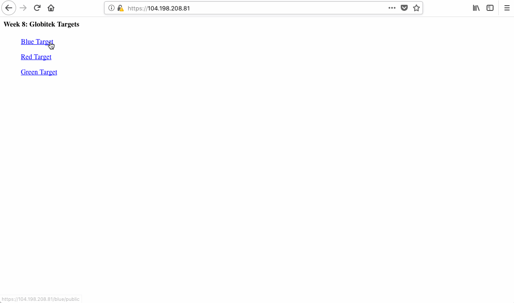
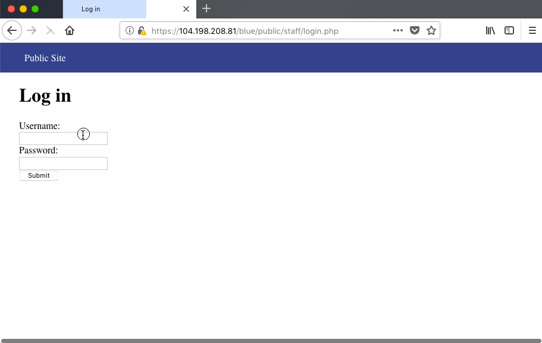
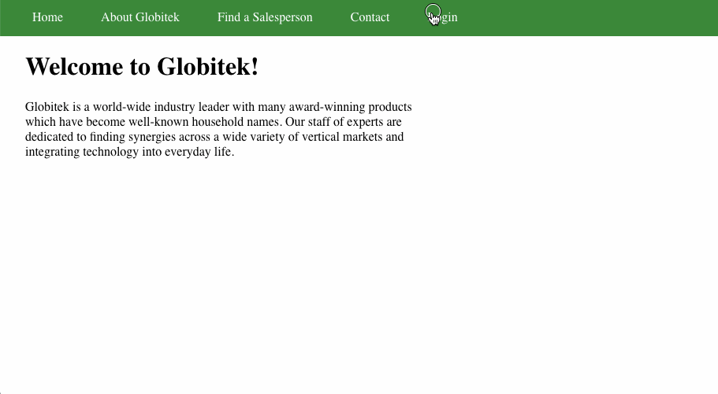
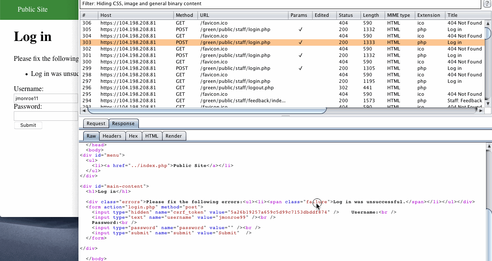
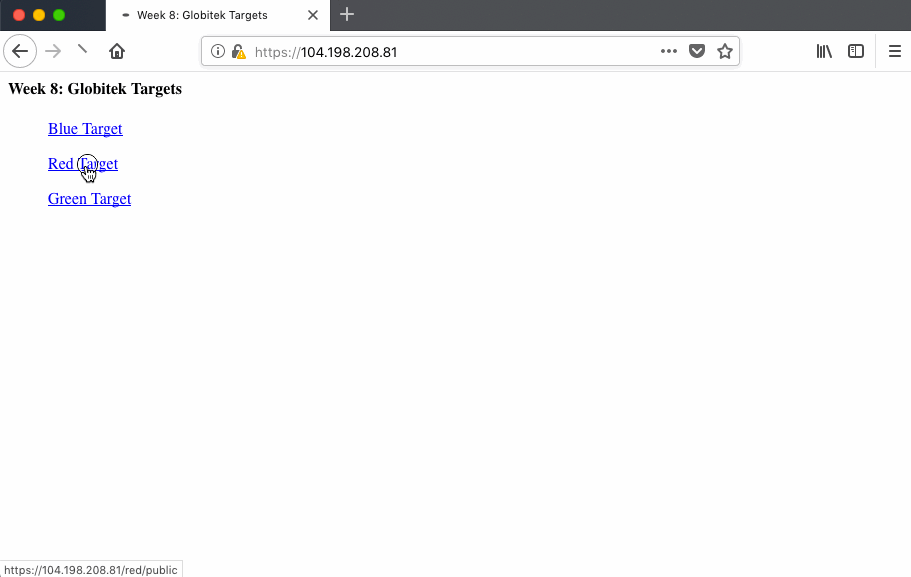
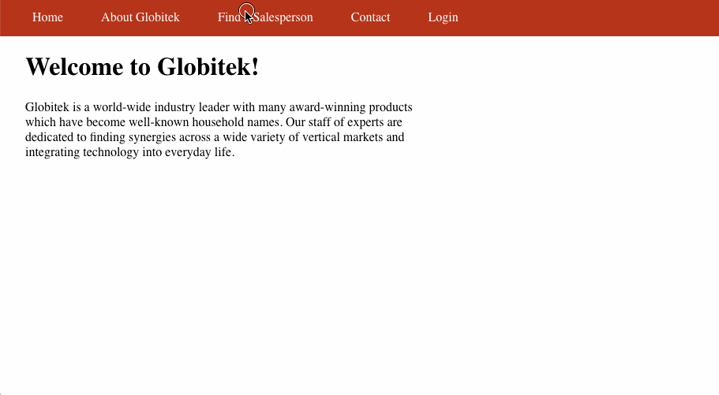

# Project 8 - Pentesting Live Targets

Time spent: **28** hours spent in total

> Objective: Identify vulnerabilities in three different versions of the Globitek website: blue, green, and red.

The six possible exploits are:
* Username Enumeration
* Insecure Direct Object Reference (IDOR)
* SQL Injection (SQLi)
* Cross-Site Scripting (XSS)
* Cross-Site Request Forgery (CSRF)
* Session Hijacking/Fixation

Each version of the site has been given two of the six vulnerabilities. (In other words, all six of the exploits should be assignable to one of the sites.)

## Blue

Vulnerability #1: SQL Injection

Vulnerability #2: Session Hijacking/Fixation

## Green

Vulnerability #1: Cross-Site Scripting

Vulnerability #2: Username Enumeration

## Red

Vulnerability #1: Insecure Direct Object Reference

Vulnerability #2: Cross-Site Request Forgery

## Notes

I found this week's assignments to be very time consuming compared to other weeks and it would have been better if we had more time to finish this week's lab as there was a lot of new material to learn/explore before being able to solve the milestones and lab.